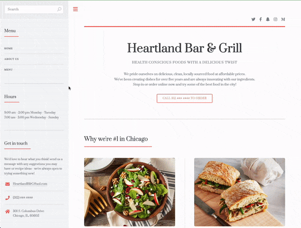
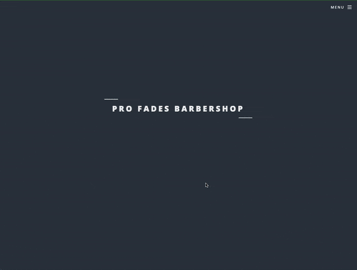
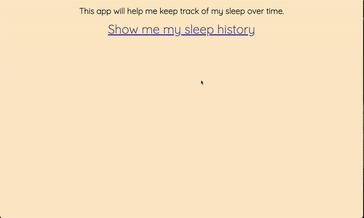

<h1 align="center">Hello, I'm Gian!</h1>
<h3 align="center"> I am a Software Engineer in the Chicagoland area.</h3>

- 🔭 I’m currently working on **a website for a music entertainment agency.**

- 🌱 I’m currently learning **about MVC and Auth! Wild!**

- 👨‍💻 All of my projects are available at [https://gian-carnero.netlify.app/](https://gian-carnero.netlify.app/)

- 📫 You can reach me at **gian.carnero@gmail.com**

- ⚡ Fun fact about me is that **I hate that I care about my lawn.**

<h3 align="left">Connect with me:</h3>

<h3 align="left">Languages and Tools:</h3>

        

<!--Project Section -->

<h2 align="center">Some Projects </h2>

<table>
<tr>
<td width="50%">
<h3 align="center" color="white">Kusina De Manila Restaurant Site</h2>

  

 
 

<strong>Wix — Built a responsive website for a client through the Wix website building interface.

</td>
<td width="50%">
<h3 align="center" color="white">Heartland Bar and Grill Landing Page</h2>

  

 
 

  

<strong>JavaScript, CSS3, HTML5</strong> — Created a responsive desktop and mobile website for customers of Heartland Bar and Grill.

<tr>
</td>
<td width="50%">
<h3 align="center" color="white">Pro Fades Barbershop Landing Page</h2>

  

 
 

  

<strong>JavaScript, CSS3, HTML5</strong> — Created a fully responsive desktop and mobile website for Pro Fades Barbershop.

</td>
<td width="50%">
<h3 align="center" color="white">Sleep Tracker App</h2>

  

 
 
 
 

  

<strong>HTML5, CSS, Javascript, Node, MongoDB, EJS, MVC</strong> I built a sleep tracker app for myself to help me log and keep track of my sleep and to practice MVC. 

</td>
<tr>
<!---- coming
<td width="50%">
<h3 align="center" color="white">Coming Soon</h2>

  

 
 

  

<strong></strong> - 

---->
</table>
